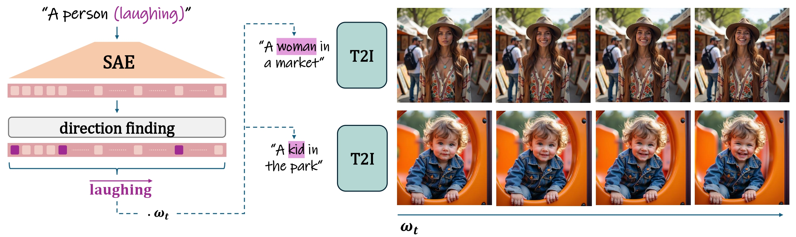

# SAEdit: Token-level control for continuous image editing via Sparse AutoEncoder
> **Ronen Kamenetsky, Sara Dorfman, Daniel Garibi, Roni Paiss, Or Patashnik, Daniel Cohen-Or**
>
> Large-scale text-to-image diffusion models have become the backbone of modern image editing, yet text prompts alone do not offer adequate control over the editing process. Two properties are especially desirable: disentanglement, where changing one attribute does not unintentionally alter others, and continuous control, where the strength of an edit can be smoothly adjusted. We introduce a method for disentangled and continuous editing through token-level manipulation of text embeddings. The edits are applied by manipulating the embeddings along carefully chosen directions, which control the strength of the target attribute. To identify such directions, we employ a Sparse Autoencoder (SAE), whose sparse latent space exposes semantically isolated dimensions. Our method operates directly on text embeddings without modifying the diffusion process, making it model agnostic and broadly applicable to various image synthesis backbones. Experiments show that it enables intuitive and efficient manipulations with continuous control across diverse attributes and domains.

<a href="https://ronen94.github.io/SAEdit/"></a> 
<a href="https://arxiv.org/abs/2510.05081"></a>

<p align="center">

</p>

## Description
The official implementation of the paper SAEdit: Token-level control for continuous image editing via Sparse AutoEncoder

## Environment Setup
Our code builds on the requirement of the `diffusers` library. To set up the environment, please run:
```
conda env create -f environment.yaml
conda activate saeedit_env
```
or install requirements:
```
pip install -r requirements.txt
```

## Usage
To run our method, insert the SAEdit block as a callback function as can be seen bellow, and in the example subfolder.
```
from src.saedit import SAEditCallback
import numpy as np
import torch

factor = 0.
target_edit_token = 'man'
variation_path = "src/variations/smiling_man.yaml"
source_sentence = "a portrait of a man riding a donkey in the snow"
seed = 42
with open(variation_path, "r") as f:
    variation_data = yaml.safe_load(f)
sentence_pairs=variation_data["sentence_pairs"]


t5_block = SAEditCallback(
    factor=factor,
    prompt=source_sentence,
    source_tokens_to_edit=target_edit_token,  # ["man"]
    sae=sae_model_baseline,
    pipeline=model,
    sentence_pairs = sentence_pairs
)


out = model(
    prompt=source_sentence,
    guidance_scale=3.5,
    height=1024, width=1024,
    num_inference_steps=40,
    max_sequence_length=256,
    generator=torch.Generator(device='cuda').manual_seed(seed),
    callback_on_step_end=t5_block,
    callback_on_step_end_tensor_inputs=CALLBACK_ON_STEP_END_INPUT_TENSORS
)
out.images[0]
```

## Citation
If you use this code for your research, please cite the following work: 
```
@misc{kamenetsky2025saedittokenlevelcontrolcontinuous,
      title={SAEdit: Token-level control for continuous image editing via Sparse AutoEncoder}, 
      author={Ronen Kamenetsky and Sara Dorfman and Daniel Garibi and Roni Paiss and Or Patashnik and Daniel Cohen-Or},
      year={2025},
      eprint={2510.05081},
      archivePrefix={arXiv},
      primaryClass={cs.GR},
      url={https://arxiv.org/abs/2510.05081}, 
}
```